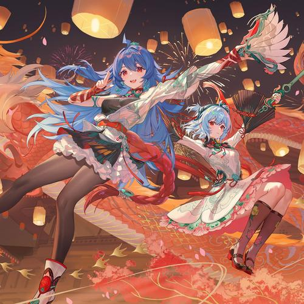
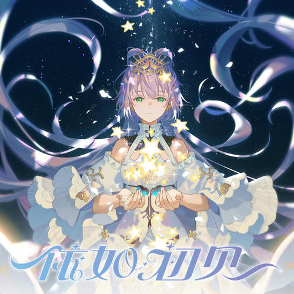
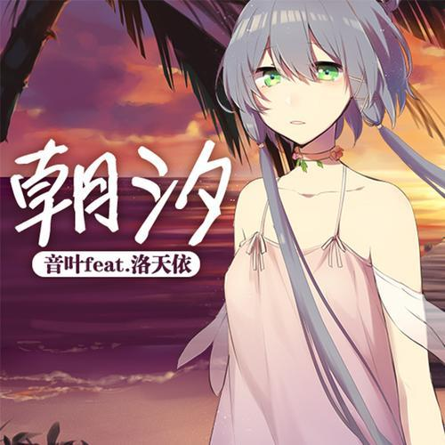
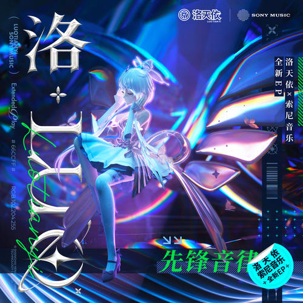
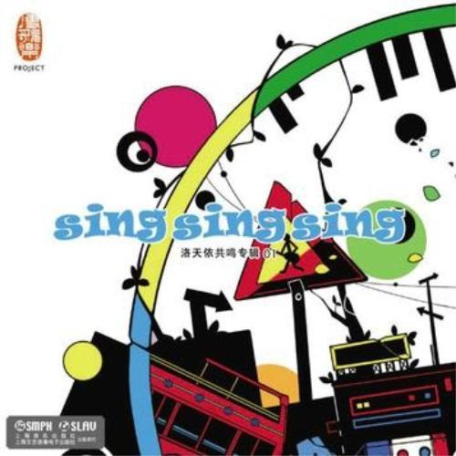

# 每日一曲
###### 为什么只有洛天依呢？为什么只有洛天依呢？
天依天依，天下第一。华风夏韵，洛水天依。  
[表格版](chart.md)

## 2月20日
[Time to Shine](http://www.kuwo.cn/play_detail/192223628)

## 2月21日
[写给我第一个喜欢的女孩的歌](https://www.kugou.com/song/#7rcqpkc1)

## 2月22日
[大哉乾元](http://www.kuwo.cn/play_detail/340152514)

## 2月23日
[上山岗](http://www.kuwo.cn/play_detail/144552578)

## 2月24日
[勾指起誓](https://music.163.com/#/song?id=1345872140)

懒得放图了（网易云不给图）

## 2月25日
[为了你唱下去](http://www.kuwo.cn/play_detail/238691161)

## 2月26日
[三千世界鸦杀尽](https://music.163.com/#/song?id=27908601)

网易云就是没图

## 2月27日
[天上的风](https://music.163.com/#/song?id=2111775853)  
还是网易云

## 2月28日
[I LOVE U](http://www.kuwo.cn/play_detail/238691132)  

## 2月29日
[人间应又雪](http://www.kuwo.cn/play_detail/311449076)  

## 3月1日
[一花依世界](http://www.kuwo.cn/play_detail/238691082)  

## 3月2日
[朝汐(Single Version)](http://www.kuwo.cn/play_detail/55385622)  

## 3月3日
[粉色夕阳](http://www.kuwo.cn/play_detail/337205936)  

## 3月4日
[山妖](http://www.kuwo.cn/play_detail/337205943)  

## 3月5日
[茉莉花的音符](http://www.kuwo.cn/play_detail/21325701)  

## 3月6日
[三月雨](http://www.kuwo.cn/play_detail/21325670)  

## 3月7日
[自然物语](http://www.kuwo.cn/play_detail/21325706)  

## 3月8日
[Fell Your Dream](http://www.kuwo.cn/play_detail/21325702)  

## 3月9日
[风萤月](www.kuwo.cn/play_detail/21325703)  

## 3月10日
[普通DISCO](http://www.kuwo.cn/play_detail/10967140)  
  
`` 这是中文VOCALOID第一首神话曲！ ``  
> 我想起那天晚上也是在这，咱们一起拥有了中文Vocaloid第一首传说曲。
> 撒花，唱歌，我们普通的摇，无比快乐。
> 当时激动，现在感慨。当时激动前途无量，现在感慨光阴如水。
> 这五年，我们的理想暗淡了又明晰；希望破碎了又重聚；那道次元障壁打破了又弥合；那些歌声也确实在很多角落响起过。
> 后来我们还是回到这里，把故事和岁月写到一个缓慢但确实增长的数字里。一千万播放，怎么想都觉得好多啊，这该是多少快乐的耳机或者失眠的夜晚啊。
> 我不知道当时的愿景算不算是实现了，但是让这么多人产生过共鸣，我也算干得不错。回头想想，传说的荣耀也理应属于我。
> 不过神话曲，这则是真真正正由你们各位所创造的奇迹。
> 因为你们在听，因为你们还在听，老普通——今天是普皇——以及后面必然会到来的第二首，三首……更多神话曲们，才会仍旧拥有着充沛的生命力。愿它和它们仍然给你快乐和力量。
> 这场面我还真没见过。来吧所有人一起，为《普通DISCO》——
> 神话入，撒花。

## 3月11日
[万分之一的光](http://www.kuwo.cn/play_detail/238691098)  

